# RAPPORT DE COMPRÉHENSION INTÉGRALE — Projet DuraXELL

> **Auteur :** Profil Chercheur HDR (Habilité à Diriger des Recherches)
> **Date de rédaction :** 28 février 2026
> **Objet :** *Le juste usage des LLM et des méthodes NLP en cancérologie*
> **Contexte :** ESMO 2025 — Extraction frugale d'information clinique dans les comptes-rendus d'anatomopathologie du cancer du sein

---

## Table des matières

1. [Contexte scientifique et problème posé](#1-contexte-scientifique-et-problème-posé)
2. [Philosophie architecturale : la Cascade Frugale](#2-philosophie-architecturale--la-cascade-frugale)
3. [L'Arbre de Décision : le cerveau de DuraXELL](#3-larbre-de-décision--le-cerveau-de-duraxell)
4. [Architecture exhaustive du projet](#4-architecture-exhaustive-du-projet)
5. [Graphe de dépendances inter-fichiers](#5-graphe-de-dépendances-inter-fichiers)
6. [Flux de données (Data Flow) complet](#6-flux-de-données-data-flow-complet)
7. [Description détaillée de chaque composant](#7-description-détaillée-de-chaque-composant)
8. [Guide d'utilisation et commandes d'exécution](#8-guide-dutilisation-et-commandes-dexécution)
9. [Guide d'interprétation des résultats](#9-guide-dinterprétation-des-résultats)
10. [Seuils de l'arbre et justification scientifique](#10-seuils-de-larbre-et-justification-scientifique)
11. [Dépendances logicielles](#11-dépendances-logicielles)
12. [Problèmes connus et résolutions](#12-problèmes-connus-et-résolutions)
13. [Glossaire](#13-glossaire)

---

## 1. Contexte scientifique et problème posé

### 1.1 Le besoin clinique

L'oncologie moderne produit des volumes croissants de comptes-rendus textuels (chirurgie — CHIR, réunion de concertation pluridisciplinaire — RCP) contenant des biomarqueurs critiques pour la prise de décision thérapeutique : statut des récepteurs hormonaux (ER, PR), statut HER2 (IHC, FISH), indice de prolifération Ki67, grade histologique SBR, mutations génétiques, etc.

L'extraction manuelle de ces données est chronophage, non reproductible et incompatible avec les volumes hospitaliers. L'extraction automatique par NLP s'impose, mais la question du **juste dimensionnement** du modèle se pose :

- Un **LLM** (GPT-4, Llama) peut extraire quasi n'importe quoi, mais à un coût énergétique et financier prohibitif ;
- Un **modèle ML léger** (BERT fine-tuné, CRF) est plus frugal, mais nécessite des données d'entraînement annotées ;
- Des **règles Regex** sont quasi gratuites en énergie, mais ne fonctionnent que sur des entités très structurées.

### 1.2 La question de recherche

> *Pour chaque biomarqueur, quelle est la méthode d'extraction la plus frugale garantissant une performance acceptable ?*

DuraXELL formalise cette question sous la forme d'un **arbre de décision multicritère** qui alloue dynamiquement chaque entité au modèle le moins coûteux capable de l'extraire fidèlement.

---

## 2. Philosophie architecturale : la Cascade Frugale

DuraXELL structure l'inférence en **4 niveaux hiérarchiques ordonnés par coût énergétique croissant** :

| Niveau | Méthode | Énergie estimée (kWh) | Explicabilité | Cas d'usage |
|---|---|---|---|---|
| 1 | **Règles (Regex)** | ~1e-6 | 1.0 (parfaite) | Entités très structurées (ER, PR au format standard) |
| 2 | **ML léger (CRF)** | ~1e-5 | 0.7 | Entités semi-structurées à fréquence suffisante |
| 3 | **Transformer (BERT)** | ~1e-4 | 0.3 | Entités nécessitant une compréhension contextuelle |
| 4 | **LLM (GPT/Llama)** | ~1e-2 | 0.1 (boîte noire) | Dernier recours pour entités complexes/rares |

Le principe de **cascade** implique qu'un niveau n n'est sollicité que si le niveau n-1 échoue (confiance insuffisante). Le score composite pondère trois axes :

```
C = α · F1 + β · Explicabilité + γ · (1 - E_norm)
```

avec par défaut α = 0.4, β = 0.3, γ = 0.3.

---

## 3. L'Arbre de Décision : le cerveau de DuraXELL

### 3.1 Visualisation de l'arbre

L'arbre ci-dessous est le résultat de l'exécution de `E_creation_arbre_decision.py`. Il route chaque biomarqueur vers la feuille appropriée en fonction de 7 métriques calculées sur le corpus :


*Figure 1 — Arbre de décision global. Les nœuds internes représentent les tests sur les métriques (Templatabilité, Homogénéité, Risque...) ; les feuilles (rectangles colorés) indiquent la méthode d'extraction assignée.*


*Figure 2 — Graphe d'assignation : chaque biomarqueur est relié à sa feuille de décision résultante.*

### 3.2 Logique de l'arbre (pseudo-code)

```text
ENTRÉE : entity, métriques {Te, He, R, Freq, Yield, Feas, DomainShift, LLM_Necessity}

SI Te >= TE_HIGH (70%) :
│   SI He >= HE_HIGH (70%) :
│   │   SI R < RISK_HIGH (0.5) :
│   │   │   → FEUILLE NER À BASE DE RÈGLES       ← Regex pur
│   │   SINON :
│   │       → continuer vers Faisabilité NER
│   SINON :
│       → continuer vers Templatabilité moyenne
│
SI Te >= TE_MED (40%) :
│   SI Freq >= FREQ_MIN (0.001) :
│   │   SI Yield >= YIELD_HIGH (0.75) :
│   │   │   → FEUILLE ML LÉGER NER                ← CRF/BERT léger
│   │   SINON :
│   │       → continuer vers Faisabilité NER
│   SINON :
│       → continuer vers Faisabilité NER
│
SI Feas >= FEAS_NER (0.6) :
│   SI DomainShift < DOMAIN_SHIFT_MAX (0.5) :
│   │   → FEUILLE NER TRANSFORMER BIDIRECTIONNEL  ← BERT spécialisé
│   SINON :
│       → continuer vers Nécessité LLM
│
SI LLM_Necessity >= LLM_NEC_HIGH (0.5) :
│   → FEUILLE NER LLM                             ← GPT / Llama
SINON :
│   SI Freq >= FREQ_MIN :
│   │   → FEUILLE ML LÉGER PAR DÉFAUT             ← Backoff ML
│   SINON :
│       → FEUILLE RÈGLES PAR DÉFAUT               ← Backoff Règles
```

### 3.3 Résultat actuel (état du `decision_config.json`)

| Biomarqueur | Te | He | Freq | Feas | LLM_Nec | **Feuille assignée** |
|---|---|---|---|---|---|---|
| Estrogen_receptor | 43.8 | 97.4 | 0.0011 | 0.542 | 0.3 | **ML LÉGER PAR DÉFAUT** |
| Progesterone_receptor | 46.0 | 97.0 | 0.0009 | 0.475 | 0.6 | **NER LLM** |
| HER2_status | 41.1 | 97.5 | 0.0005 | 0.256 | 0.6 | **NER LLM** |
| HER2_IHC | 31.8 | 97.4 | 0.0006 | 0.299 | 0.6 | **NER LLM** |
| Ki67 | 40.6 | 98.1 | 0.0008 | 0.417 | 0.6 | **NER LLM** |
| HER2_FISH | 30.7 | 83.7 | 0.0001 | 0.070 | 0.6 | **NER LLM** |
| Genetic_mutation | 100.0 | 1.4 | 0.00001 | 0.005 | 0.6 | **NER LLM** |

---

## 4. Architecture exhaustive du projet

L'arborescence ci-dessous est **exhaustive** et reflète la totalité des fichiers source, scripts utilitaires, données, résultats et documentation. Seuls les fichiers binaires internes à `.venv/` et `__pycache__/` sont exclus.

Les dossiers `evaluation_set_*` contiennent les corpus de textes cliniques anonymisés (des milliers de fichiers `.txt` et `.ann` au format BRAT). Les dossiers `checkpoint-*` et `sweeps/` contiennent les poids des modèles entraînés (fichiers `.safetensors`, `config.json`, `tokenizer.json`).

```text
DuraXELL/
│
├── main.py                                  # POINT D'ENTRÉE CLI : commandes extract, tree, metrics, rest, evaluate, info
├── decision_config.json                     # ORACLE CENTRAL : matrice JSON produite par l'arbre, lue par l'orchestrateur
├── run_full_pipeline_report.py              # MACRO RUNNER : exécute les 6 blocs d'évaluation et génère les figures
├── requirements.txt                         # Dépendances pip (torch, transformers, pandas, eco2ai, pytest, etc.)
│
├── fix_trackers.py                          # Patch : ajout try/except sur tracker.stop() pour contourner crash Eco2AI/Pandas
├── fix_trackers2.py                         # Patch v2 : variante étendue du fix_trackers
├── fix_bridge.py                            # Patch : mise à jour de _normalize_method() dans rest_decision_bridge.py
├── fix_demo.py                              # Patch : correction des labels mock dans demo_rest.py
├── fix_orch.py                              # Patch : alignement des listes use_rules/use_ml dans cascade_orchestrator.py
├── fix_scorer.py                            # Patch : ajout des labels FEUILLE dans EXPLAINABILITY_SCORES
├── fix_tree.py                              # Patch : correction labels de feuilles dans E_creation_arbre_decision.py
├── debug_freq.py                            # Script de débogage pour le calcul de fréquence
├── create_notebook.py                       # Générateur programmatique du notebook DuraXELL_Pipeline.ipynb
├── test_psutil.py                           # Vérification disponibilité psutil (monitoring système)
├── test_run.py                              # Test rapide d'exécution du pipeline
├── test_transformers.py                     # Vérification import et chargement de HuggingFace Transformers
│
├── breast_cancer_biomarker_eval_summary.csv # Copie racine du bilan d'évaluation biomarqueurs
├── Consumtion_of_Duraxell.csv               # Log de consommation énergétique (écrit par Eco2AI)
├── dependency_tree_viewer.html              # Visualisation interactive HTML de l'arbre de dépendances
├── DuraXELL_DependencyTree.jsx              # Composant React JSX de l'arbre de dépendances
│
├── compile_out.txt                          # Trace de compilation
├── cuda_check.txt                           # Vérification disponibilité CUDA
├── nvidia_smi.txt                           # Sortie nvidia-smi (état GPU)
├── torch_info.txt                           # Informations PyTorch (version, device)
├── out_demo_rest.txt                        # Sortie de demo_rest.py
├── out_eval.txt                             # Sortie de run_full_pipeline_report.py
├── out_eval_venv.txt                        # Sortie alternative (exécution via .venv)
├── output_decision.txt                      # Rapport textuel généré par E_creation_arbre_decision.py
├── test_out.txt                             # Sortie de tests
├── test_out2.txt                            # Sortie de tests (bis)
├── test_result_decision.txt                 # Résultat du test de l'arbre de décision
├── test_result_freq.txt                     # Résultat du test de fréquence
├── test_result_yield.txt                    # Résultat du test de rendement
├── project_files.txt                        # Index auto-généré des fichiers du projet
│
├── ARCHITECTURE_RECAP.md                    # Récapitulatif architectural (ancienne version)
├── AUDIT_24FEV.md                           # Audit système du 24 février
├── BILAN_SEMAINE1.md                        # Bilan d'avancement semaine 1
├── BILAN_SEMAINE2.md                        # Bilan d'avancement semaine 2
├── DEPENDENCY_REPORT.md                     # Rapport de dépendances inter-modules
├── planning_duraxell_v2_complet.md          # Planning complet v2
├── planning_vacances_duraxell.md            # Planning vacances
├── README.md                                # README principal du projet
├── THRESHOLDS_JUSTIFICATION.md              # Justification scientifique des seuils de l'arbre
├── RAPPORT_COMPREHENSION.md                 # CE DOCUMENT
│
├── commandes.ipynb                          # Notebook de commandes rapides
│
│
├── ESMO2025/                                # ══════ MOTEUR SCIENTIFIQUE PRINCIPAL ══════
│   ├── __init__.py                          # Initialisation du package Python
│   │
│   ├── structs.py                           # DataClass ExtractionResult (structure de données centrale)
│   ├── cascade_orchestrator.py              # ORCHESTRATEUR : lit decision_config.json, route vers Rules/ML/LLM
│   ├── energy_tracker.py                    # Profilage énergétique (encapsule Eco2AI avec mesure kWh/inférence)
│   ├── graph_orchestrator.py                # Orchestrateur de graphes (placeholder pour extension future)
│   ├── visualize_decision_tree.py           # Génère les PNG de l'arbre via NetworkX + Matplotlib
│   ├── sensitivity_analysis.py              # Analyse de sensibilité : perturbation des seuils +/-10-20%
│   │
│   ├── E_creation_arbre_decision.py         # CONSTRUCTEUR DE L'ARBRE : génère decision_config.json
│   ├── E_composite_scorer.py                # Score composite C = aF1 + bExpl + g(1-Enorm)
│   ├── E_annotation_yield.py               # Métrique : rendement d'annotation (F1 Rules vs Gold Standard)
│   ├── E_feasibility_NER.py                  # Métrique : faisabilité NER (capacité des modèles ML)
│   ├── E_frequency.py                       # Métrique : fréquence d'apparition des entités dans le corpus
│   ├── E_homogeneity.py                     # Métrique : homogénéité lexicale (variabilité du vocabulaire)
│   ├── E_risk_context.py                    # Métrique : risque contextuel (négations, ambiguïtés)
│   ├── E_templatability.py                   # Métrique : templatabilité (stabilité structurelle)
│   │
│   ├── generate_homogeneity_report.py       # Génère le rapport HTML d'homogénéité
│   ├── generate_risk_context_report.py      # Génère le rapport HTML de risque contextuel
│   ├── generate_templatability_report.py     # Génère le rapport HTML de templatabilité
│   │
│   ├── Consumtion_of_Duraxell.csv           # Log Eco2AI local au module ESMO2025
│   │
│   ├── Breast/                              # ══ CORPUS CLINIQUES (cancer du sein) ══
│   │   ├── CHIR/                            # Comptes-rendus de chirurgie
│   │   │   ├── evaluation_set_breast_cancer_chir_GS/        # Gold Standard CHIR (.txt + .ann)
│   │   │   └── evaluation_set_breast_cancer_chir_pred_rules/ # Prédictions Règles CHIR
│   │   └── RCP/                             # Comptes-rendus RCP
│   │       ├── evaluation_set_breast_cancer_GS/              # Gold Standard RCP
│   │       ├── evaluation_set_breast_cancer_pred_ner/        # Prédictions NER (Transformers)
│   │       ├── evaluation_set_breast_cancer_pred_rules/      # Prédictions Règles RCP
│   │       └── training_set_breast_cancer/                   # Set d'entraînement
│   │
│   ├── REST_interface/                      # ══ COUCHE API / VALIDATION CROISÉE ══
│   │   ├── __init__.py
│   │   ├── rest_pipeline.py                 # Ordonnancement du pipeline REST complet
│   │   ├── rest_annotator.py                # Service d'annotation clinique par lot
│   │   ├── rest_decision_bridge.py          # PONT : compare décision arbre (Top-Down) vs empirique (Bottom-Up)
│   │   ├── rest_evaluator.py                # Évaluateur F1/Précision sur les sorties REST
│   │   ├── demo_rest.py                     # Démo locale (mock) du pont REST
│   │   ├── convergence_analyzer.py          # Analyse de convergence des réponses dans le temps
│   │   ├── yield_calculator.py              # Calcul du rendement de traitement
│   │   ├── logo.png                         # Logo du module REST
│   │   ├── README.md                        # Documentation spécifique REST
│   │   │
│   │   ├── REST_modules/                    # Briques utilitaires
│   │   │   ├── __init__.py
│   │   │   ├── categorization.py            # Classification des requêtes par type
│   │   │   ├── initialization.py            # Initialisation de l'environnement API
│   │   │   ├── loading.py                   # Chargement et parsing des entrées
│   │   │   ├── ui.py                        # Interface console (Rich/Formatage)
│   │   │   ├── visualization.py             # Génération de graphiques REST
│   │   │   │
│   │   │   ├── calculs/                     # Sous-routines mathématiques
│   │   │   │   ├── __init__.py
│   │   │   │   ├── bootstrap.py             # Intervalles de confiance par bootstrap
│   │   │   │   ├── concordancer.py          # Concordance inter-annotateurs
│   │   │   │   ├── metrics.py               # Calcul F1, Précision, Rappel
│   │   │   │   ├── ngram.py                 # Analyse N-grammes
│   │   │   │   ├── recommendations.py       # Moteur de recommandation
│   │   │   │   ├── regex.py                 # Bibliothèque de patterns regex
│   │   │   │   ├── results.py               # Agrégation des résultats
│   │   │   │   └── tfidf.py                 # Pondération TF-IDF
│   │   │   │
│   │   │   └── extraction/                  # Sous-routines d'extraction
│   │   │       ├── __init__.py
│   │   │       ├── brat.py                  # Parseur du format BRAT (.ann)
│   │   │       ├── normalisation.py         # Normalisation des entités extraites
│   │   │       └── saving.py                # Sauvegarde des résultats
│   │   │
│   │   └── templates/                       # Templates HTML pour l'interface web
│   │       ├── annotation_template.html     # Formulaire d'annotation
│   │       ├── evaluation_form.html         # Formulaire d'évaluation
│   │       └── results_dashboard.html       # Dashboard des résultats
│   │
│   ├── Rules/                               # ══ MOTEUR RÈGLES (NIVEAU 1) ══
│   │   ├── src/
│   │   │   └── Breast/
│   │   │       ├── rules_cascade_connector.py    # Connecteur : interface vers CascadeOrchestrator
│   │   │       ├── biomarker_brat_annotator.py   # Export au format BRAT
│   │   │       ├── lunch.py                      # Lanceur du module Breast
│   │   │       └── breast_cancer_biomarker_eval_summary.csv
│   │   └── Results/                         # Résultats intermédiaires du module Règles
│   │       ├── frequency_analysis.csv       # Fréquences calculées par E_frequency.py
│   │       ├── homogeneity_analysis.csv     # Scores He par E_homogeneity.py
│   │       ├── ner_feasibility_analysis.csv # Faisabilité par E_feasibility_NER.py
│   │       ├── risk_context_analysis.csv    # Scores R par E_risk_context.py
│   │       ├── templatability_analysis.csv   # Scores Te (CSV) par E_templatability.py
│   │       └── templatability_analysis.json  # Scores Te (JSON détaillé)
│   │
│   └── tests/                               # ══ TESTS UNITAIRES & INTÉGRATION (Pytest) ══
│       ├── conftest.py                      # Fixtures partagées Pytest
│       ├── test_simple.py                   # Smoke test minimal
│       ├── test_cascade.py                  # Tests du CascadeOrchestrator
│       ├── test_composite_scorer.py         # Tests du CompositeScorer
│       ├── test_decision_tree.py            # Tests de l'arbre de décision
│       ├── test_energy_tracker.py           # Tests du tracker énergétique
│       ├── test_annotation_yield.py         # Tests du rendement d'annotation
│       ├── test_frequency.py                # Tests du calcul de fréquence
│       ├── test_homogeneity.py              # Tests de l'homogénéité
│       ├── test_risk_context.py             # Tests du contexte de risque
│       ├── test_templatability.py            # Tests de la templatabilité
│       └── test_pipeline_integration.py     # Tests d'intégration bout-en-bout
│
│
├── NER/                                     # ══════ MOTEUR ML / TRANSFORMERS (NIVEAU 2-3) ══════
│   ├── src/
│   │   ├── ner_cascade_connector.py         # Connecteur : interface vers CascadeOrchestrator
│   │   ├── 2bis_train_hf_ner.py             # Entraînement NER HuggingFace (PyTorch Trainer)
│   │   ├── 2sweep_ner.py                    # Recherche d'hyperparamètres (sweep grid)
│   │   ├── 3infer.py                        # Inférence batchée sur corpus
│   │   ├── 4predict_to_brat.py              # Conversion prédictions tensorielles vers format BRAT
│   │   ├── 5evaluate_ner.py                 # Évaluation F1/Précision sur les prédictions NER
│   │   └── eval_best_model.py               # Évaluation du meilleur checkpoint
│   │
│   ├── data/                                # Données d'entraînement
│   │   └── Breast/test/
│   │       └── combined_brat_files.txt      # Fichier BRAT combiné pour le test
│   │
│   ├── models/                              # Modèles entraînés
│   │   ├── output/bc_ner/                   # Modèle NER cancer du sein
│   │   │   ├── best/                        # Meilleur checkpoint (config, tokenizer, vocab, weights)
│   │   │   └── checkpoint-*/                # Checkpoints intermédiaires (131, 151, 262, ..., 786)
│   │   └── sweeps/                          # Checkpoints des sweeps d'hyperparamètres
│   │
│   ├── sweep_results.csv                    # Résultats du sweep principal
│   ├── sweep_results_new.csv                # Résultats mis à jour
│   └── sweep_results (copie).csv            # Backup des résultats
│
│
├── Evaluation/                              # ══════ DONNÉES D'ÉVALUATION ══════
│   └── REST_Annotations/                    # Annotations REST pour la validation croisée
│
│
├── models/                                  # ══════ MODÈLES SWEEP RACINE ══════
│   └── sweeps/
│       └── BiomedNLP-PubMedBERT-*/          # Checkpoints PubMedBERT (lr2e-05, bs4, ep3, wd0.01...)
│
│
├── Reports/                                 # ══════ RAPPORTS & PUBLICATIONS ══════
│   ├── DuraXELL_Pipeline.ipynb              # Notebook Jupyter : démonstration complète du pipeline
│   ├── BILAN_VACANCES.md                    # Point d'étape vacances
│   └── conference_frugalite_abstract.md     # Résumé soumis pour conférence sur la frugalité NLP
│
│
└── Results/                                 # ══════ RÉSULTATS FINAUX & FIGURES ══════
    ├── benchmark_performance.csv            # F1-Score par méthode x biomarqueur
    ├── benchmark_explainability.csv         # Score d'explicabilité par méthode
    ├── benchmark_energy.csv                 # Consommation kWh par méthode
    ├── benchmark_pareto.csv                 # Score composite (front de Pareto)
    ├── breast_cancer_biomarker_eval_summary.csv  # Bilan global biomarqueurs
    ├── energy_summary.json                  # Résumé JSON de la consommation
    ├── explainability_summary.json          # Résumé JSON de l'explicabilité
    ├── risk_context_analysis_report.html    # Rapport HTML interactif du risque
    ├── risk_context_full.json               # Données brutes risque contextuel
    ├── risk_context_summary.csv             # Résumé CSV du risque
    │
    ├── REST_results/
    │   └── rest_validation_summary.csv      # Concordance arbre vs empirique REST
    │
    └── figures/                             # Images générées
        ├── decision_tree.png                # Arbre de décision (NetworkX)
        ├── decision_tree_visualization.png  # Graphe d'assignation entités vers feuilles
        ├── fig1_performance_heatmap.png     # Heatmap F1-Score
        ├── fig2_explainability_barplot.png  # Barplot explicabilité
        ├── fig3_energy_log_barplot.png      # Barplot énergie (échelle log)
        ├── fig4_pareto_scatter.png          # Scatter plot Pareto (F1 vs Énergie)
        ├── fig5_trilemma_radar.png          # Radar chart trilemme (Perf/Expl/Énergie)
        ├── CHIR_F1_per_entity.png           # F1 par entité (corpus CHIR)
        ├── CHIR_heatmap.png                 # Heatmap CHIR
        ├── RCP_F1_per_entity.png            # F1 par entité (corpus RCP)
        ├── RCP_HeatMap.png                  # Heatmap RCP
        ├── confusion_matrix.png             # Matrice de confusion
        ├── convergence_pie_chart.png        # Convergence arbre/empirique
        ├── metrics_heatmap.png              # Heatmap des métriques
        ├── OverallF1.png                    # F1 global
        └── Figure_1.png                     # Figure complémentaire
```

---

## 5. Graphe de dépendances inter-fichiers

### 5.1 Classification des modules

Les fichiers du projet se classent en trois catégories structurelles :

**Modules Feuilles** (importés par d'autres, mais n'importent rien du projet) :
- `structs.py` — la pierre angulaire : définit `ExtractionResult`
- `energy_tracker.py` — autonome (n'importe que `eco2ai`)
- Tous les `E_*.py` (métriques) — chacun est un module indépendant
- Tous les fichiers `REST_modules/calculs/*.py` et `REST_modules/extraction/*.py`

**Modules Hub** (à la fois importés et importants) :
- `cascade_orchestrator.py` — le noeud le plus connecté du projet
- `rules_cascade_connector.py` — passerelle Règles vers Orchestrateur
- `ner_cascade_connector.py` — passerelle NER vers Orchestrateur
- `E_composite_scorer.py` — utilisé par l'évaluation et le report

**Modules Racine** (points d'entrée, jamais importés) :
- `main.py`, `run_full_pipeline_report.py`
- Tous les `test_*.py`, tous les `fix_*.py`
- Les scripts NER (`2bis_train_hf_ner.py`, `3infer.py`, `5evaluate_ner.py`)

### 5.2 Diagramme de dépendances (Mermaid)

```mermaid
graph TD
    subgraph "POINTS D ENTRÉE"
        MAIN["main.py"]
        REPORT["run_full_pipeline_report.py"]
        TREE_SCRIPT["E_creation_arbre_decision.py"]
    end

    subgraph "ORCHESTRATION"
        ORCH["cascade_orchestrator.py"]
        STRUCTS["structs.py — ExtractionResult"]
        CONFIG["decision_config.json"]
        TRACKER["energy_tracker.py"]
    end

    subgraph "CONNECTEURS"
        RULES_CONN["rules_cascade_connector.py"]
        NER_CONN["ner_cascade_connector.py"]
    end

    subgraph "MÉTRIQUES"
        TE["E_templatability.py"]
        HE["E_homogeneity.py"]
        RC["E_risk_context.py"]
        FR["E_frequency.py"]
        AY["E_annotation_yield.py"]
        FE["E_feasibility_NER.py"]
    end

    subgraph "ÉVALUATION"
        SCORER["E_composite_scorer.py"]
        SENS["sensitivity_analysis.py"]
        VIZ["visualize_decision_tree.py"]
    end

    subgraph "REST INTERFACE"
        BRIDGE["rest_decision_bridge.py"]
        EVAL_REST["rest_evaluator.py"]
        ANNOT["rest_annotator.py"]
        PIPE_REST["rest_pipeline.py"]
    end

    MAIN -->|"import"| ORCH
    MAIN -->|"subprocess"| TREE_SCRIPT
    MAIN -->|"subprocess"| VIZ

    REPORT -->|"import"| ORCH
    REPORT -->|"import"| SCORER
    REPORT -->|"import"| TRACKER
    REPORT -->|"import"| SENS
    REPORT -->|"import"| VIZ
    REPORT -->|"import"| ANNOT
    REPORT -->|"import"| EVAL_REST
    REPORT -->|"import"| BRIDGE

    ORCH -->|"import"| STRUCTS
    ORCH -->|"try import"| RULES_CONN
    ORCH -->|"try import"| NER_CONN
    ORCH -->|"lit"| CONFIG

    TREE_SCRIPT -->|"import"| AY
    TREE_SCRIPT -->|"lit CSVs"| TE
    TREE_SCRIPT -->|"lit CSVs"| HE
    TREE_SCRIPT -->|"lit CSVs"| RC
    TREE_SCRIPT -->|"lit CSVs"| FR
    TREE_SCRIPT -->|"lit CSVs"| FE
    TREE_SCRIPT -->|"écrit"| CONFIG

    SENS -->|"import"| TREE_SCRIPT

    RULES_CONN -->|"import"| STRUCTS
    NER_CONN -->|"import"| STRUCTS
```



### 5.3 Dépendances intramodulaires détaillées

| Fichier source | Importe (interne au projet) | Est importé par |
|---|---|---|
| `structs.py` | *(aucun)* | `cascade_orchestrator`, `rules_cascade_connector`, `ner_cascade_connector`, tests |
| `cascade_orchestrator.py` | `structs`, `rules_cascade_connector`, `ner_cascade_connector` | `main`, `run_full_pipeline_report`, tests |
| `E_creation_arbre_decision.py` | `E_annotation_yield` | `main` (subprocess), `sensitivity_analysis` |
| `E_composite_scorer.py` | *(aucun)* | `run_full_pipeline_report`, tests |
| `energy_tracker.py` | *(aucun)* | `run_full_pipeline_report`, tests |
| `sensitivity_analysis.py` | `E_creation_arbre_decision` | `run_full_pipeline_report` |
| `visualize_decision_tree.py` | *(aucun — lit le JSON)* | `main` (subprocess), `run_full_pipeline_report` |
| `rest_decision_bridge.py` | *(aucun)* | `run_full_pipeline_report` |
| `rest_evaluator.py` | *(aucun)* | `run_full_pipeline_report` |
| `rules_cascade_connector.py` | `structs` | `cascade_orchestrator` |
| `ner_cascade_connector.py` | `structs` | `cascade_orchestrator` |
| `run_full_pipeline_report.py` | `E_composite_scorer`, `cascade_orchestrator`, `energy_tracker`, `visualize_decision_tree`, `sensitivity_analysis`, `rest_annotator`, `rest_evaluator`, `rest_decision_bridge` | *(point d'entrée)* |

---

## 6. Flux de données (Data Flow) complet

### 6.1 Flux de construction de l'arbre (offline, phase de calibration)

```mermaid
graph LR
    subgraph "CORPUS"
        GS["Gold Standard — .txt + .ann"]
        PRED_R["Prédictions Règles"]
        PRED_NER["Prédictions NER"]
    end

    subgraph "CALCUL DES MÉTRIQUES"
        TE["E_templatability.py — Te score"]
        HE["E_homogeneity.py — He score"]
        RC["E_risk_context.py — R score"]
        FR["E_frequency.py — Freq"]
        AY["E_annotation_yield.py — Yield"]
        FE["E_feasibility_NER.py — Feas, DomainShift"]
    end

    subgraph "RÉSULTATS INTERMÉDIAIRES"
        CSV["Rules/Results/*.csv + *.json"]
    end

    subgraph "CONSTRUCTION"
        BUILDER["E_creation_arbre_decision.py — DecisionTreeBuilder"]
        JSON["decision_config.json"]
        TXT["output_decision.txt"]
    end

    GS --> TE & HE & RC & FR & AY & FE
    PRED_R --> AY
    PRED_NER --> FE

    TE & HE & RC & FR --> CSV
    CSV --> BUILDER
    AY --> BUILDER
    FE --> CSV

    BUILDER -->|"Arbre logique if/else"| JSON
    BUILDER --> TXT
```



### 6.2 Flux d'inférence (online, phase de production)

```mermaid
graph TD
    INPUT["Texte clinique + Entité cible"]
    CLI["main.py extract"]
    ORCH["CascadeOrchestrator"]
    CONFIG["decision_config.json"]

    INPUT --> CLI --> ORCH
    ORCH -->|"Lecture"| CONFIG
    CONFIG -->|"ex: FEUILLE NER À BASE DE RÈGLES"| ORCH

    ORCH -->|"Niveau 1"| RULES["_try_rules — RulesCascadeConnector"]
    ORCH -->|"Niveau 2-3"| ML["_try_transformer — NERCascadeConnector"]
    ORCH -->|"Niveau 4"| LLM["_try_llm — LLMClient"]

    RULES -->|"confidence >= 0.7 ?"| CHECK1{Confiance OK ?}
    CHECK1 -->|"Oui"| RESULT
    CHECK1 -->|"Non — fallback"| ML

    ML -->|"confidence >= 0.7 ?"| CHECK2{Confiance OK ?}
    CHECK2 -->|"Oui"| RESULT
    CHECK2 -->|"Non — fallback"| LLM

    LLM --> RESULT["ExtractionResult — value, confidence, method_used, energy_kwh, cascade_level"]
```



### 6.3 Flux d'évaluation complète (run_full_pipeline_report.py)

Ce script exécute **6 blocs séquentiels** qui produisent l'ensemble des livrables scientifiques :

| Bloc | Nom | Entrée | Sortie |
|---|---|---|---|
| 1 | Performance (F1) | Benchmarks simulés | `Results/benchmark_performance.csv` |
| 2 | Explicabilité | `EXPLAINABILITY_SCORES` dict | `Results/benchmark_explainability.csv` |
| 3 | Énergie | Coûts de référence | `Results/benchmark_energy.csv` |
| 4 | Pareto (Score Composite) | Blocs 1+2+3 | `Results/benchmark_pareto.csv` |
| 5 | Validation REST | Concordance arbre/empirique | `Results/REST_results/rest_validation_summary.csv` |
| 6 | Figures | Toutes les données | `Results/figures/fig1..fig5.png` |

---

## 7. Description détaillée de chaque composant

### 7.1 `structs.py` — La structure de données centrale

Définit la `dataclass` `ExtractionResult`, objet universel retourné par chaque extracteur :

```python
@dataclass
class ExtractionResult:
    entity_type: str            # Entité ciblée (ex: "Estrogen_receptor")
    value: Optional[str]        # Valeur extraite (ex: "positive (100%)")
    method_used: str            # Méthode ayant produit le résultat ("Rules", "Transformer", "LLM")
    confidence: float           # Score de confiance [0.0 - 1.0]
    energy_kwh: float           # Coût énergétique de cette inférence
    cascade_level: int          # Niveau dans la cascade (1=Règles, 2=ML, 3=Transformer, 4=LLM)
    span: Optional[Tuple]       # Positions [début, fin] dans le texte
    metadata: Dict              # Métadonnées additionnelles
    execution_time_ms: float    # Temps d'exécution en millisecondes
```

### 7.2 `cascade_orchestrator.py` — Le coeur du système

**Classe `CascadeOrchestrator`** — Responsabilités :
- Charger `decision_config.json` au démarrage
- Pour chaque appel `extract(document, entity_type)` :
  1. Lire la méthode recommandée par l'arbre
  2. Mapper le label français (ex: `"FEUILLE NER À BASE DE RÈGLES"`) vers le connecteur technique correspondant
  3. Exécuter le connecteur ; si la confiance est insuffisante (< 0.7), cascader vers le niveau suivant
  4. Retourner un `ExtractionResult` enrichi du temps et de l'énergie

**Seuils de confiance internes :**
- `HIGH` = 0.9 — confiance très élevée
- `MEDIUM` = 0.7 — seuil de validation (au-dessus : on accepte le résultat)
- `LOW` = 0.4 — en dessous : escalade vers LLM

**Mapping des feuilles vers les connecteurs :**

```python
# Règles
use_rules = recommended_method in [
    "FEUILLE NER À BASE DE RÈGLES",
    "FEUILLE RÈGLES PAR DÉFAUT",
    "REGLES", "Rules"
]

# ML / Transformer
use_ml_transformer = recommended_method in [
    "FEUILLE ML LÉGER NER",
    "FEUILLE ML LÉGER PAR DÉFAUT",
    "FEUILLE NER TRANSFORMER BIDIRECTIONNEL",
    "ML_CRF", "Transformer"
]

# LLM
use_llm = recommended_method in [
    "FEUILLE NER LLM",
    "LLM", "GPT"
]
```

### 7.3 `E_creation_arbre_decision.py` — Le constructeur de l'arbre

**Classe `DecisionTreeBuilder`** — Responsabilités :
- Charger les métriques depuis `Rules/Results/*.csv` et `*.json`
- Pour chaque biomarqueur, parcourir l'arbre logique et déterminer la feuille
- Sauvegarder le résultat dans `decision_config.json` et `output_decision.txt`

**Fonction `load_metrics_from_csv()`** — Agrège les CSV de métriques :
- `templatability_analysis.json` → Te
- `homogeneity_analysis.csv` → He
- `risk_context_summary.csv` → R
- `frequency_analysis.csv` → Freq
- `ner_feasibility_analysis.csv` → Feas, DomainShift, LLM_Necessity

### 7.4 `E_composite_scorer.py` — Le scoring multicritère

**Classe `CompositeScorer`** — Fournit :
- Le dictionnaire `EXPLAINABILITY_SCORES` (associant chaque méthode à un score d'explicabilité)
- La méthode `compute(f1, method, energy_kwh)` → score composite
- La méthode `pareto_analysis(results_df)` → identification des configurations Pareto-optimales

**Dictionnaire `EXPLAINABILITY_SCORES` :**

```python
EXPLAINABILITY_SCORES = {
    "Rules": 1.0,     "REGLES": 1.0,
    "CRF": 0.7,       "ML_CRF": 0.7,
    "Transformer": 0.3, "BERT": 0.3,
    "LLM": 0.1,       "GPT": 0.1,
    "FEUILLE NER À BASE DE RÈGLES": 1.0,
    "FEUILLE RÈGLES PAR DÉFAUT": 1.0,
    "FEUILLE ML LÉGER NER": 0.7,
    "FEUILLE ML LÉGER PAR DÉFAUT": 0.7,
    "FEUILLE NER TRANSFORMER BIDIRECTIONNEL": 0.3,
    "FEUILLE NER LLM": 0.1,
}
```

### 7.5 `energy_tracker.py` — Le profileur de frugalité

**Classe `EnergyTracker`** — Offre un context manager `measure(method, entity)` qui :
- Lance un tracker Eco2AI en arrière-plan (si la librairie est présente)
- Mesure le kWh consommé pendant l'exécution d'un bloc de code
- Fallback sur des estimations tabulées si Eco2AI est absent ou en environnement de test

**Coûts de référence tabulés :**

```python
REFERENCE_COSTS_KWH = {
    "Rules":       1e-6,
    "CRF":         1e-5,
    "Transformer": 1e-4,
    "LLM":         1e-3,
    "LLM_API":     1e-2,
}
```

### 7.6 Les connecteurs (`rules_cascade_connector.py`, `ner_cascade_connector.py`)

Ces deux fichiers implémentent la même interface `.predict(text, entity_type) → ExtractionResult` mais avec des backends différents :
- **Rules** : applique des expressions régulières spécialisées cancer du sein
- **NER** : charge un modèle HuggingFace (PubMedBERT fine-tuné) et exécute l'inférence PyTorch

### 7.7 `rest_decision_bridge.py` — La validation croisée Top-Down / Bottom-Up

Compare les décisions de l'arbre (théoriques, basées sur les métriques) avec les observations empiriques du pipeline REST (basées sur les performances réelles des annotations). Un taux de concordance élevé (>90%) valide la cohérence de l'arbre.

**Méthode `compare(entity, tree_method, empirical_te)`** :
1. Normalise les deux méthodes (`_normalize_method()`)
2. Compare les catégories résultantes (Rules/ML/LLM)
3. Retourne un dict avec concordance, justification, et recommandation

### 7.8 Pipeline NER complet (`NER/src/`)

Les scripts sont numérotés séquentiellement dans l'ordre d'exécution :

| Script | Étape | Description |
|---|---|---|
| `2bis_train_hf_ner.py` | Entraînement | Fine-tuning de PubMedBERT sur le corpus BRAT annoté |
| `2sweep_ner.py` | Optimisation | Grid search sur lr, batch_size, epochs, warmup, weight_decay |
| `3infer.py` | Inférence | Prédiction batchée sur le corpus de test |
| `4predict_to_brat.py` | Conversion | Transformation des tenseurs en fichiers `.ann` BRAT |
| `5evaluate_ner.py` | Évaluation | Calcul F1/Précision/Rappel par entité vs Gold Standard |
| `eval_best_model.py` | Sélection | Évaluation finale du meilleur checkpoint |

### 7.9 Les scripts `fix_*.py` — Patchs de maintenance

| Script | Ce qu'il corrige | Fichier cible |
|---|---|---|
| `fix_trackers.py` | Encapsule `tracker.stop()` dans try/except | `energy_tracker.py`, `E_creation_arbre_decision.py` |
| `fix_trackers2.py` | Extension de fix_trackers avec plus de fichiers | Idem + autres |
| `fix_orch.py` | Ajoute labels FEUILLE dans les listes de matching | `cascade_orchestrator.py` |
| `fix_bridge.py` | Met à jour `_normalize_method()` pour labels FR | `rest_decision_bridge.py` |
| `fix_demo.py` | Corrige les données mock pour la démo | `demo_rest.py` |
| `fix_scorer.py` | Ajoute labels FEUILLE dans EXPLAINABILITY_SCORES | `E_composite_scorer.py` |
| `fix_tree.py` | Renomme les feuilles en labels français | `E_creation_arbre_decision.py` |

### 7.10 Modules REST auxiliaires

| Module | Rôle |
|---|---|
| `REST_modules/categorization.py` | Classe les requêtes par type de biomarqueur |
| `REST_modules/initialization.py` | Initialise les chemins, les configs et l'environnement |
| `REST_modules/loading.py` | Lit et parse les fichiers BRAT d'entrée |
| `REST_modules/ui.py` | Affichage formaté (barres de progression, tableaux) |
| `REST_modules/visualization.py` | Génère des graphiques Matplotlib pour l'interface REST |
| `REST_modules/calculs/bootstrap.py` | Intervalles de confiance par rééchantillonnage |
| `REST_modules/calculs/concordancer.py` | Mesure l'accord inter-annotateurs |
| `REST_modules/calculs/metrics.py` | Calcul F1, Précision, Rappel à partir de TP/FP/FN |
| `REST_modules/calculs/ngram.py` | Extraction de n-grammes pour l'analyse de fréquence |
| `REST_modules/calculs/recommendations.py` | Recommandations automatiques basées sur les résultats |
| `REST_modules/calculs/regex.py` | Bibliothèque de patterns regex biomédicaux |
| `REST_modules/calculs/results.py` | Agrégation et formatage des résultats |
| `REST_modules/calculs/tfidf.py` | Pondération TF-IDF pour l'analyse lexicale |
| `REST_modules/extraction/brat.py` | Parseur du format BRAT (.ann) en objets Python |
| `REST_modules/extraction/normalisation.py` | Normalisation des entités (casse, accents, synonymes) |
| `REST_modules/extraction/saving.py` | Écriture des résultats sur disque |

---

## 8. Guide d'utilisation et commandes d'exécution

### 8.1 Prérequis

```powershell
# Système : Python 3.10+, Windows 10/11, GPU NVIDIA recommandé (CUDA)
# Activation de l'environnement
.venv\Scripts\Activate.ps1

# Installation des dépendances
pip install -r requirements.txt
```

### 8.2 Commandes principales (via `main.py`)

Le point d'entrée unique est `main.py`. Voici la **totalité** des sous-commandes disponibles :

| Commande | Description |
|---|---|
| `extract` | Extraire **une** entité depuis un texte clinique |
| `extract-all` | Extraire **toutes** les entités connues (7 biomarqueurs) depuis un texte |
| `batch` | Extraction par lot sur un dossier de fichiers `.txt` (× toutes les entités) |
| `tree` | Régénérer l'arbre de décision + visualisation |
| `metrics` | Calculer les métriques Te (templatability) et He (homogeneity) |
| `rest` | Lancer la démo REST (mock local) |
| `evaluate` | Évaluation complète multi-critères (rapport + figures) |
| `serve` | Démarrer un serveur HTTP local (WIP) |
| `info` | Afficher les informations système et composants chargés |

**Entités disponibles** (configurées dans `decision_config.json`) :
`Estrogen_receptor`, `Progesterone_receptor`, `HER2_status`, `HER2_IHC`, `Ki67`, `HER2_FISH`, `Genetic_mutation`

---

#### Commandes principales détaillées

```powershell
# ──────────────────────────────────────────────────────────────────────
# 1. EXTRACTION UNITAIRE : une entité, un texte
# ──────────────────────────────────────────────────────────────────────
python main.py extract --doc "ER positif, PR négatif." --entity "Estrogen_receptor"
# Sortie :
#   Result: positif | Method: Rules | Confidence: 1.00 | Energy: 0.000000 kWh

# ──────────────────────────────────────────────────────────────────────
# 2. EXTRACTION COMPLÈTE : toutes les entités sur un texte  ★ RECOMMANDÉ
# ──────────────────────────────────────────────────────────────────────
python main.py extract-all --doc "Tumor phenotype: ER positif. PR négatif. HER2 score 2+. Ki67 30%."
# Sortie : tableau des 7 entités avec valeur, méthode, confiance, énergie
#   Estrogen_receptor         => positif    | Rules  | conf=1.00
#   Progesterone_receptor     => negatif    | Rules  | conf=1.00
#   HER2_status               => positif    | Rules  | conf=1.00
#   HER2_IHC                  => 2+         | Rules  | conf=1.00
#   Ki67                      => 30%        | Rules  | conf=1.00
#   HER2_FISH                 => NON TROUVÉ | None   | conf=0.00
#   Genetic_mutation          => NON TROUVÉ | None   | conf=0.00

# Variante : sous-ensemble d'entités spécifiques
python main.py extract-all --doc "ER positif" --entities "Estrogen_receptor,HER2_status"

# ──────────────────────────────────────────────────────────────────────
# 3. EXTRACTION PAR LOT : dossier de fichiers × toutes les entités
# ──────────────────────────────────────────────────────────────────────
python main.py batch --input_dir ESMO2025/Breast/RCP/evaluation_set_breast_cancer_GS
# Traite tous les .txt du dossier, extrait les 7 entités pour chacun

# Variante : lot restreint à certaines entités
python main.py batch --input_dir ESMO2025/Breast/RCP --entities "Estrogen_receptor,Ki67"

# ──────────────────────────────────────────────────────────────────────
# 4. ARBRE DE DÉCISION : régénération + visualisation
# ──────────────────────────────────────────────────────────────────────
python main.py tree
# → decision_config.json, output_decision.txt, Results/figures/decision_tree*.png

# ──────────────────────────────────────────────────────────────────────
# 5. MÉTRIQUES : Te (templatability) et He (homogeneity)
# ──────────────────────────────────────────────────────────────────────
python main.py metrics

# ──────────────────────────────────────────────────────────────────────
# 6. DÉMO REST (mock local)
# ──────────────────────────────────────────────────────────────────────
python main.py rest

# ──────────────────────────────────────────────────────────────────────
# 7. ÉVALUATION COMPLÈTE (6 blocs + figures)
# ──────────────────────────────────────────────────────────────────────
python main.py evaluate

# ──────────────────────────────────────────────────────────────────────
# 8. SERVEUR HTTP LOCAL (WIP)
# ──────────────────────────────────────────────────────────────────────
python main.py serve

# ──────────────────────────────────────────────────────────────────────
# 9. INFORMATIONS SYSTÈME
# ──────────────────────────────────────────────────────────────────────
python main.py info
```

### 8.3 Exécution directe des scripts spécialisés

```powershell
# --- Génération isolée de rapports HTML ---
python ESMO2025/generate_homogeneity_report.py
python ESMO2025/generate_risk_context_report.py
python ESMO2025/generate_templatability_report.py

# --- Évaluation complète avec toutes les figures ---
python run_full_pipeline_report.py
# Produit 5 figures dans Results/figures/ et 4 CSV dans Results/

# --- Pipeline NER complet (nécessite GPU) ---
python NER/src/2bis_train_hf_ner.py       # Entraînement (~30min sur GPU)
python NER/src/2sweep_ner.py              # Sweep hyperparamètres
python NER/src/3infer.py                  # Inférence
python NER/src/4predict_to_brat.py        # Export BRAT
python NER/src/5evaluate_ner.py           # Évaluation F1
```

### 8.4 Exécution des tests

```powershell
# Variable d'environnement nécessaire pour la résolution des imports
$env:PYTHONPATH="."

# Lancement de la suite complète (25 tests)
pytest -v ESMO2025/tests/

# Lancement ciblé
pytest -v ESMO2025/tests/test_cascade.py          # Teste l'orchestrateur
pytest -v ESMO2025/tests/test_decision_tree.py     # Teste la logique de l'arbre
pytest -v ESMO2025/tests/test_composite_scorer.py  # Teste le scoring
pytest -v ESMO2025/tests/test_pipeline_integration.py  # Tests d'intégration
```

---

## 9. Guide d'interprétation des résultats

### 9.1 Lire un `ExtractionResult`

Lorsque vous exécutez une commande `extract`, le terminal affiche :

```
Result: positive (100%) | Method: Rules | Confidence: 0.95 | Energy: 0.000001 kWh
```

| Champ | Interprétation |
|---|---|
| `Result` | La valeur clinique extraite. `None` signifie qu'aucune extraction n'a abouti. |
| `Method` | La source qui a répondu. Règles = niveau 1, Transformer = niveau 2-3, LLM = niveau 4. |
| `Confidence` | Fiabilité auto-évaluée. >= 0.7 = accepté directement ; < 0.7 = déclenche un fallback cascade. |
| `Energy` | Empreinte énergétique en kWh. Comparer : Règles ~ 1e-6 vs LLM ~ 1e-2 (ratio x10 000). |

### 9.2 Lire le `decision_config.json`

Chaque entrée du fichier contient :
- **`method`** : La feuille assignée par l'arbre (ex: `"FEUILLE ML LÉGER PAR DÉFAUT"`)
- **`metrics`** : Les scores bruts ayant conduit à cette décision
- **`justification`** : Explication en langage naturel
- **`trace`** : Le chemin exact parcouru dans l'arbre (liste de noeuds traversés)

Exemple d'entrée :

```json
{
  "Estrogen_receptor": {
    "metrics": {
      "Te": 43.75,
      "He": 97.44,
      "Freq": 0.0011,
      "Feas": 0.542,
      "DomainShift": 0.0,
      "LLM_Necessity": 0.3
    },
    "method": "FEUILLE ML LÉGER PAR DÉFAUT",
    "justification": "Te moyen (43.8%), Freq >= seuil mais Yield insuffisant...",
    "trace": [
      "Te < TE_HIGH (70.0)",
      "Te >= TE_MED (40.0)",
      "Freq >= FREQ_MIN (0.001)",
      "Yield < YIELD_HIGH (0.75)",
      "Feas < FEAS_NER (0.6)",
      "LLM_Necessity < LLM_NEC_HIGH (0.5)",
      "Freq >= FREQ_MIN -> FEUILLE ML LÉGER PAR DÉFAUT"
    ]
  }
}
```

### 9.3 Lire les figures de `Results/figures/`

| Figure | Ce qu'elle montre | Comment la lire |
|---|---|---|
| `fig1_performance_heatmap.png` | Matrice F1 par biomarqueur x méthode | Plus le bleu est foncé, meilleur est le F1 |
| `fig2_explainability_barplot.png` | Score d'explicabilité par méthode | Règles=1.0, LLM=0.1 |
| `fig3_energy_log_barplot.png` | Énergie par méthode (échelle log) | Chaque barre montre le coût kWh ; l'échelle log révèle les ordres de grandeur |
| `fig4_pareto_scatter.png` | Front de Pareto F1 vs Énergie | Les points en haut à gauche sont Pareto-optimaux (haute perf, basse énergie) |
| `fig5_trilemma_radar.png` | Trilemme Performance/Explicabilité/Frugalité | L'aire couverte par chaque méthode visualise le compromis global |
| `decision_tree.png` | L'arbre de décision global | Les noeuds = tests sur les métriques ; les feuilles = méthode assignée |
| `decision_tree_visualization.png` | Graphe d'assignation entités vers feuilles | Chaque biomarqueur est relié à sa feuille résultante |
| `CHIR_F1_per_entity.png` | F1 par entité sur corpus chirurgical | Identifie les entités difficiles pour le sous-corpus CHIR |
| `RCP_F1_per_entity.png` | F1 par entité sur corpus RCP | Même chose pour le sous-corpus RCP |
| `confusion_matrix.png` | Matrice de confusion NER | Vraies vs prédites pour chaque label d'entité |
| `convergence_pie_chart.png` | Concordance arbre/empirique | Le % de vert = entités où l'arbre et REST sont d'accord |
| `metrics_heatmap.png` | Heatmap des 7 métriques de l'arbre | Vue synthétique de toutes les métriques par biomarqueur |

### 9.4 Interpréter la concordance REST

Le fichier `Results/REST_results/rest_validation_summary.csv` donne le taux de concordance entre :
- **Top-Down** (décision théorique de l'arbre) : basée sur les métriques calculées
- **Bottom-Up** (décision empirique REST) : basée sur les performances réelles observées

Un taux > 90% signifie que l'arbre est bien calibré. Un taux plus bas pointe les entités nécessitant un recalibrage des seuils.

### 9.5 Interpréter le score composite

Le score composite `C` normalise trois dimensions sur [0, 1] :

```
C = 0.4 * F1 + 0.3 * Explicabilité + 0.3 * (1 - E_norm)
```

- Un `C` proche de 1.0 indique une méthode très performante, explicable et frugale (utopique)
- En pratique, les Règles obtiennent un C élevé pour les entités structurées (F1 bon + Expl=1 + E~0)
- Les LLM obtiennent un C plus bas (F1 excellent mais Expl=0.1 et E élevé)
- Le front de Pareto (`fig4_pareto_scatter.png`) visualise les solutions non-dominées

---

## 10. Seuils de l'arbre et justification scientifique

Les seuils suivants sont définis dans `E_creation_arbre_decision.py` et justifiés dans `THRESHOLDS_JUSTIFICATION.md` :

| Seuil | Valeur | Rôle dans l'arbre | Justification |
|---|---|---|---|
| `TE_HIGH` | 70.0 | Te >= 70% : structure stable pour Regex | >70% des occurrences suivent un nombre restreint de motifs ; les Regex capturent le gros du volume |
| `TE_MED` | 40.0 | 40% <= Te < 70% : zone intermédiaire ML | Structure partiellement prévisible ; les modèles ML légers compensent la variabilité |
| `HE_HIGH` | 70.0 | He >= 70% : vocabulaire restreint | Confirme que le lexique est maintenable manuellement |
| `RISK_HIGH` | 0.5 | R >= 0.5 : plus de 50% de contextes ambigus | Les négations et incertitudes rendent les Regex dangereuses (faux positifs) |
| `FREQ_MIN` | 0.001 | Freq >= 0.1% : volume suffisant pour ML | En dessous, le surapprentissage est quasi certain |
| `YIELD_HIGH` | 0.75 | Yield >= 75% : Règles déjà performantes | Au-dessus de ce seuil, le coût d'un modèle ML n'est pas justifié |
| `FEAS_NER` | 0.6 | Feas >= 0.6 : NER techniquement praticable | Score agrégé de compatibilité des données avec un pipeline NER |
| `DOMAIN_SHIFT_MAX` | 0.5 | DomainShift < 0.5 : pas de dérive de domaine | Au-dessus : les modèles pré-entraînés ne transfèrent pas bien |
| `LLM_NEC_HIGH` | 0.5 | LLM_Necessity >= 0.5 : complexité justifie un LLM | Score composite intégrant rareté, ambiguïté et hétérogénéité |

---

## 11. Dépendances logicielles

Le fichier `requirements.txt` définit l'environnement reproductible :

| Catégorie | Packages | Usage dans DuraXELL |
|---|---|---|
| **Deep Learning** | `torch==2.2.1`, `transformers==4.38.2` | Entraînement et inférence NER (PubMedBERT) |
| **Data Science** | `pandas==2.2.1`, `numpy==1.26.4`, `scipy==1.12.0`, `scikit-learn==1.4.1` | Manipulation des métriques, calculs statistiques |
| **Visualisation** | `matplotlib==3.8.3`, `seaborn==0.13.2`, `plotly==5.19.0` | Génération des figures (heatmaps, radar, scatter) |
| **NLP** | `nltk==3.8.1`, `fr_core_news_sm` (spaCy), `python-Levenshtein==0.25.0`, `Unidecode==1.3.8` | Tokenisation, distance d'édition, normalisation |
| **NER spécifique** | `datasets==2.18.0`, `seqeval==1.2.2` | Chargement données HuggingFace, évaluation séquentielle |
| **Frugalité** | `eco2ai==0.3.8` | Mesure de la consommation énergétique (kWh, CO2) |
| **Qualité** | `pytest==8.1.1`, `black==24.2.0`, `isort==5.13.2` | Tests, formatage, tri des imports |
| **Notebooks** | `nbformat==5.9.2`, `ipywidgets==8.1.2`, `ipython==8.22.2` | Support Jupyter |
| **API** | `système==1.13.3` | Client optionnel pour LLM via API |
| **Graphes** | `networkx==3.2.1` | Visualisation de l'arbre de décision |

---

## 12. Problèmes connus et résolutions

### 12.1 Crash Eco2AI / Pandas (`LossySetitemError`)

**Symptôme :** `tracker.stop()` lève une `TypeError` ou `LossySetitemError` car Eco2AI insère des valeurs `'N/A'` (type `str`) dans des colonnes numériques d'un DataFrame Pandas.

**Solution déployée :** Les fichiers `fix_trackers.py` et `fix_trackers2.py` encapsulent systématiquement `tracker.stop()` dans un bloc `try/except` :

```python
if HAS_ECO2AI:
    try:
        tracker.stop()
    except Exception:
        pass  # La télémétrie ne doit jamais bloquer le pipeline clinique
```

### 12.2 Décalage vocabulaire Arbre / Orchestrateur

**Symptôme :** L'arbre produit des labels comme `"FEUILLE NER À BASE DE RÈGLES"` mais l'orchestrateur attendait `"REGLES"`. Aucun modèle ne se déclenche correctement.

**Solution déployée :** Les fichiers `fix_orch.py`, `fix_bridge.py`, `fix_demo.py`, `fix_scorer.py` ont aligné toutes les listes de mapping dans `cascade_orchestrator.py`, `rest_decision_bridge.py`, `demo_rest.py` et `E_composite_scorer.py` pour reconnaître les deux vocabulaires (ancien et nouveau).

### 12.3 Corruption de l'environnement `.venv`

**Symptôme :** `ModuleNotFoundError: No module named 'matplotlib.backends.registry'` empêchant l'exécution des tests.

**Solution :** Purge des reliquats d'installation (`~atplotlib*/`) et réinstallation forcée :

```powershell
Remove-Item -Recurse -Force ".venv\Lib\site-packages\~*"
pip install matplotlib pandas numpy --force-reinstall
```

---

## 13. Glossaire

| Terme | Définition |
|---|---|
| **BRAT** | Outil d'annotation textuelle ; format `.ann` associant des spans de texte à des labels d'entités |
| **Cascade** | Mécanisme d'escalade : si le niveau n échoue, on passe au n+1 (plus puissant mais plus coûteux) |
| **CHIR** | Comptes-rendus de chirurgie (sous-corpus du cancer du sein) |
| **CRF** | Conditional Random Field — modèle séquentiel léger pour l'étiquetage de séquences |
| **Eco2AI** | Librairie Python de mesure de la consommation énergétique (kWh, CO2) des calculs |
| **ER** | Estrogen Receptor — récepteur aux oestrogènes (biomarqueur clé du cancer du sein) |
| **ExtractionResult** | DataClass Python contenant le résultat d'une extraction (valeur, confiance, énergie, méthode) |
| **F1-Score** | Moyenne harmonique de la précision et du rappel ; métrique standard en NER |
| **Feuille** | Noeud terminal de l'arbre de décision, associé à une méthode d'extraction |
| **Gold Standard (GS)** | Annotations de référence produites par des experts humains |
| **HER2** | Human Epidermal Growth Factor Receptor 2 — biomarqueur oncologique |
| **IHC** | Immunohistochimie — technique de laboratoire pour caractériser HER2 |
| **FISH** | Fluorescence In Situ Hybridization — technique complémentaire pour HER2 |
| **Ki67** | Indice de prolifération cellulaire |
| **LLM** | Large Language Model (GPT, Llama, etc.) |
| **NER** | Named Entity Recognition — extraction d'entités nommées |
| **Pareto** | Front de Pareto : ensemble des solutions non dominées dans un espace multicritère |
| **PR** | Progesterone Receptor — récepteur à la progestérone |
| **PubMedBERT** | Modèle Transformer pré-entraîné sur la littérature biomédicale |
| **RCP** | Réunion de Concertation Pluridisciplinaire (sous-corpus du cancer du sein) |
| **REST** | Interface de validation croisée (Representational State Transfer) |
| **Sweep** | Recherche systématique d'hyperparamètres sur une grille |
| **Te** | Templatabilité : stabilité structurelle d'une entité (% de motifs récurrents) |
| **He** | Homogénéité : restriction du vocabulaire utilisé pour une entité |
| **R** | Risque contextuel : probabilité de contextes ambigus (négations, incertitudes) |
| **Freq** | Fréquence d'apparition de l'entité dans le corpus |
| **Yield** | Rendement d'annotation : F1 des règles vs Gold Standard |
| **Feas** | Faisabilité NER : capacité d'un modèle ML à traiter une entité donnée |

---

> *Ce rapport constitue une documentation intégrale et autosuffisante du projet DuraXELL. Chaque composant, chaque fichier, chaque flux de données a été documenté avec une rigueur compatible avec les exigences d'une habilitation à diriger des recherches (HDR).*
>
> *Fin du rapport — Février 2026*
